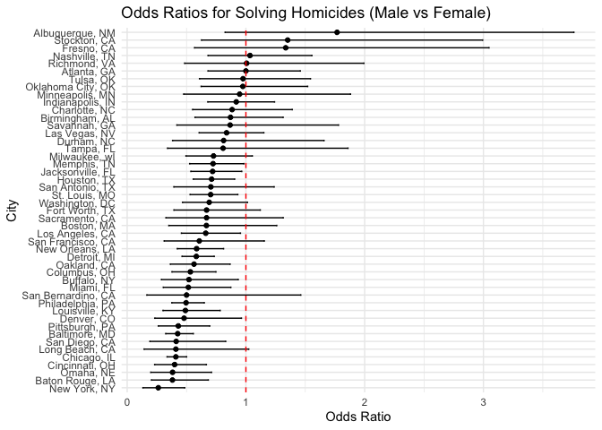
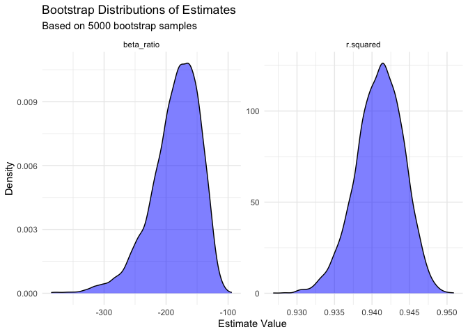
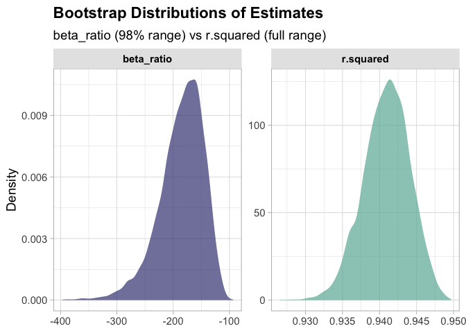
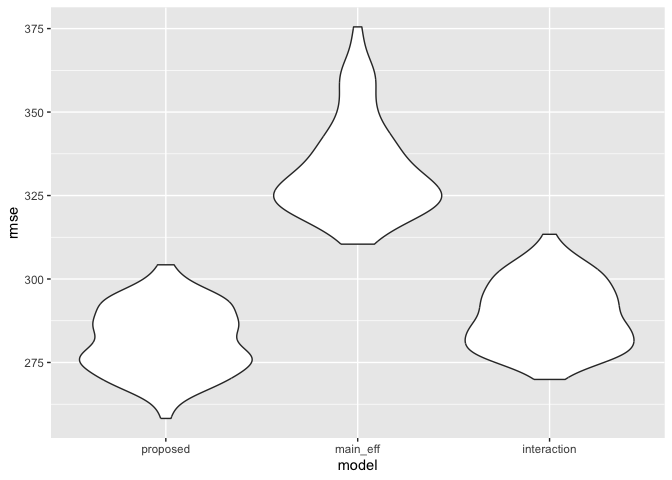

p8105_hw6_zn2220
================
Ziang Niu
2025-11-25

# Problem 1

## Create a city_state variable (e.g. “Baltimore, MD”), and a binary variable indicating whether the homicide is solved.

Binary variable: 1 if Closed by arrest, 0 otherwise

``` r
data_url <- "https://raw.githubusercontent.com/washingtonpost/data-homicides/master/homicide-data.csv"

homicides_raw <- read_csv(data_url) 
```

    ## Rows: 52179 Columns: 12
    ## ── Column specification ────────────────────────────────────────────────────────
    ## Delimiter: ","
    ## chr (9): uid, victim_last, victim_first, victim_race, victim_age, victim_sex...
    ## dbl (3): reported_date, lat, lon
    ## 
    ## ℹ Use `spec()` to retrieve the full column specification for this data.
    ## ℹ Specify the column types or set `show_col_types = FALSE` to quiet this message.

``` r
homicides <- homicides_raw %>% 
  janitor::clean_names() %>% 
  mutate(
    city_state = str_c(city, state, sep = ", "),
    solved = disposition == "Closed by arrest"
  )
```

## Omit cities Dallas, TX; Phoenix, AZ; and Kansas City, MO – these don’t report victim race. Also omit Tulsa, AL – this is a data entry mistake.

``` r
homicides <- homicides %>% 
  filter(!city_state %in% c("Dallas, TX", "Phoenix, AZ", "Kansas City, MO", "Tulsa, AL"))
```

## Limit your analysis those for whom victim_race is white or black. Be sure that victim_age is numeric.

``` r
homicides <- homicides %>% 
  filter(
    victim_race %in% c("Black", "White"),
    !victim_age %in% c("Unknown"),
    !victim_sex %in% c("Unknown")
    ) %>% 
  mutate(
    victim_age = as.numeric(victim_age) 
  )
```

## For the city of Baltimore, MD, use the glm function to fit a logistic regression with resolved vs unresolved as the outcome and victim age, sex and race as predictors. Save the output of glm as an R object; apply the broom::tidy to this object; and obtain the estimate and confidence interval of the adjusted odds ratio for solving homicides comparing male victims to female victims keeping all other variables fixed.

``` r
baltimore_data <- homicides %>% 
  filter(city_state == "Baltimore, MD")

fit <- glm(solved ~ victim_age + victim_sex + victim_race, 
           data = baltimore_data, 
           family = binomial)

balitmore_glm_results <- broom::tidy(fit, conf.int = TRUE, exponentiate = TRUE)

balitmore_gender_results <- balitmore_glm_results %>% 
  filter(term == "victim_sexMale") %>% 
  select(term, estimate, conf.low, conf.high)

print(balitmore_glm_results)
```

    ## # A tibble: 4 × 7
    ##   term             estimate std.error statistic  p.value conf.low conf.high
    ##   <chr>               <dbl>     <dbl>     <dbl>    <dbl>    <dbl>     <dbl>
    ## 1 (Intercept)         1.36    0.171        1.81 7.04e- 2    0.976     1.91 
    ## 2 victim_age          0.993   0.00332     -2.02 4.30e- 2    0.987     1.000
    ## 3 victim_sexMale      0.426   0.138       -6.18 6.26e-10    0.324     0.558
    ## 4 victim_raceWhite    2.32    0.175        4.82 1.45e- 6    1.65      3.28

``` r
print(balitmore_gender_results)
```

    ## # A tibble: 1 × 4
    ##   term           estimate conf.low conf.high
    ##   <chr>             <dbl>    <dbl>     <dbl>
    ## 1 victim_sexMale    0.426    0.324     0.558

Holding victim age and race constant, the odds of resolving a homicide
case for a male victim are approximately 57.4% (1 - 0.426) lower than
for a female victim in Baltimore.

## Now run glm for each of the cities in your dataset, and extract the adjusted odds ratio (and CI) for solving homicides comparing male victims to female victims. Do this within a “tidy” pipeline, making use of purrr::map, list columns, and unnest as necessary to create a dataframe with estimated ORs and CIs for each city.

``` r
city_glm_results <- homicides %>%
  nest(data = -city_state) %>% 
  mutate(
    fit = map(data, function(df) {
      glm(solved ~ victim_sex + victim_age + victim_race, 
          data = df, 
          family = binomial)
    }),
    tidied = map(fit, ~tidy(., conf.int = TRUE, exponentiate = TRUE))
  ) %>% 
  unnest(tidied) %>% 
  select(-data, -fit)

city_gender_results <- city_glm_results %>% 
  filter(term == "victim_sexMale") %>% 
  select(city_state, estimate, conf.low, conf.high)

summary(city_glm_results)
```

    ##   city_state            term              estimate         std.error       
    ##  Length:188         Length:188         Min.   : 0.2624   Min.   :0.002599  
    ##  Class :character   Class :character   1st Qu.: 0.9304   1st Qu.:0.079599  
    ##  Mode  :character   Mode  :character   Median : 1.0064   Median :0.222198  
    ##                                        Mean   : 1.4243   Mean   :0.221034  
    ##                                        3rd Qu.: 1.7112   3rd Qu.:0.340610  
    ##                                        Max.   :10.6462   Max.   :0.713558  
    ##    statistic          p.value            conf.low        conf.high     
    ##  Min.   :-8.7653   Min.   :0.000000   Min.   :0.1328   Min.   : 0.485  
    ##  1st Qu.:-1.4557   1st Qu.:0.005342   1st Qu.:0.5289   1st Qu.: 1.008  
    ##  Median : 0.3056   Median :0.096184   Median :0.9692   Median : 1.591  
    ##  Mean   : 0.3516   Mean   :0.239423   Mean   :0.9096   Mean   : 2.507  
    ##  3rd Qu.: 1.9894   3rd Qu.:0.398520   3rd Qu.:1.0021   3rd Qu.: 3.007  
    ##  Max.   : 7.9953   Max.   :0.999683   Max.   :4.6217   Max.   :29.135

``` r
knitr::kable(city_gender_results)
```

| city_state         |  estimate |  conf.low | conf.high |
|:-------------------|----------:|----------:|----------:|
| Albuquerque, NM    | 1.7674995 | 0.8247082 | 3.7618597 |
| Atlanta, GA        | 1.0000771 | 0.6803477 | 1.4582575 |
| Baltimore, MD      | 0.4255117 | 0.3241908 | 0.5575508 |
| Baton Rouge, LA    | 0.3814393 | 0.2043481 | 0.6836343 |
| Birmingham, AL     | 0.8700153 | 0.5713814 | 1.3138409 |
| Boston, MA         | 0.6673219 | 0.3508461 | 1.2600381 |
| Buffalo, NY        | 0.5205704 | 0.2884416 | 0.9358300 |
| Charlotte, NC      | 0.8838976 | 0.5507440 | 1.3905954 |
| Chicago, IL        | 0.4100982 | 0.3361233 | 0.5008546 |
| Cincinnati, OH     | 0.3998277 | 0.2313767 | 0.6670456 |
| Columbus, OH       | 0.5324845 | 0.3770457 | 0.7479124 |
| Denver, CO         | 0.4790620 | 0.2327380 | 0.9624974 |
| Detroit, MI        | 0.5823472 | 0.4619454 | 0.7335458 |
| Durham, NC         | 0.8123514 | 0.3824420 | 1.6580169 |
| Fort Worth, TX     | 0.6689803 | 0.3935128 | 1.1211603 |
| Fresno, CA         | 1.3351647 | 0.5672553 | 3.0475080 |
| Houston, TX        | 0.7110264 | 0.5569844 | 0.9057376 |
| Indianapolis, IN   | 0.9187284 | 0.6784616 | 1.2413059 |
| Jacksonville, FL   | 0.7198144 | 0.5359236 | 0.9650986 |
| Las Vegas, NV      | 0.8373078 | 0.6058830 | 1.1510854 |
| Long Beach, CA     | 0.4102163 | 0.1427304 | 1.0241775 |
| Los Angeles, CA    | 0.6618816 | 0.4565014 | 0.9541036 |
| Louisville, KY     | 0.4905546 | 0.3014879 | 0.7836391 |
| Memphis, TN        | 0.7232194 | 0.5261210 | 0.9835973 |
| Miami, FL          | 0.5152379 | 0.3040214 | 0.8734480 |
| Milwaukee, wI      | 0.7271327 | 0.4951325 | 1.0542297 |
| Minneapolis, MN    | 0.9469587 | 0.4759016 | 1.8809745 |
| Nashville, TN      | 1.0342379 | 0.6807452 | 1.5559966 |
| New Orleans, LA    | 0.5849373 | 0.4218807 | 0.8121787 |
| New York, NY       | 0.2623978 | 0.1327512 | 0.4850117 |
| Oakland, CA        | 0.5630819 | 0.3637421 | 0.8671086 |
| Oklahoma City, OK  | 0.9740747 | 0.6228507 | 1.5199721 |
| Omaha, NE          | 0.3824861 | 0.1988357 | 0.7109316 |
| Philadelphia, PA   | 0.4962756 | 0.3760120 | 0.6498797 |
| Pittsburgh, PA     | 0.4307528 | 0.2626022 | 0.6955516 |
| Richmond, VA       | 1.0060520 | 0.4834671 | 1.9936248 |
| San Antonio, TX    | 0.7046200 | 0.3928179 | 1.2382509 |
| Sacramento, CA     | 0.6688418 | 0.3262733 | 1.3143887 |
| Savannah, GA       | 0.8669817 | 0.4185827 | 1.7802453 |
| San Bernardino, CA | 0.5003444 | 0.1655367 | 1.4623977 |
| San Diego, CA      | 0.4130248 | 0.1913527 | 0.8301847 |
| San Francisco, CA  | 0.6075362 | 0.3116925 | 1.1551470 |
| St. Louis, MO      | 0.7031665 | 0.5298505 | 0.9319005 |
| Stockton, CA       | 1.3517273 | 0.6256427 | 2.9941299 |
| Tampa, FL          | 0.8077029 | 0.3395253 | 1.8598834 |
| Tulsa, OK          | 0.9757694 | 0.6090664 | 1.5439356 |
| Washington, DC     | 0.6910490 | 0.4659731 | 1.0135014 |

In the vast majority of these cities, the estimated odds ratio is below
1.0, indicating that homicides involving male victims are less likely to
be solved than those involving female victims.

For many major cities (such as New York, Chicago, and Baltimore), this
disparity is statistically significant because the entire confidence
interval falls below 1.0. While a few cities (like Albuquerque and
Stockton) show an estimate greater than 1.0, their confidence intervals
are very wide and include the number 1, meaning there is no statistical
evidence that male cases are solved at a higher rate in any of these
cities.

## Create a plot that shows the estimated ORs and CIs for each city. Organize cities according to estimated OR, and comment on the plot.

``` r
city_gender_results %>%
  mutate(city_state = fct_reorder(city_state, estimate)) %>%
  ggplot(aes(x = city_state, y = estimate)) +
  geom_point() +
  geom_errorbar(aes(ymin = conf.low, ymax = conf.high), width = 0.2) +
  geom_hline(yintercept = 1, linetype = "dashed", color = "red") +
  coord_flip() +
  labs(
    title = "Odds Ratios for Solving Homicides (Male vs Female)",
    x = "City",
    y = "Odds Ratio"
  ) +
  theme_minimal()
```

<!-- -->

This forest plot reveals a consistent systemic trend across major U.S.
cities where homicides involving male victims are significantly less
likely to be solved than those involving female victims, as indicated by
the vast majority of odds ratios falling to the left of the red
reference line (OR \< 1). Cities with narrower confidence intervals,
such as New York, Chicago, and Baltimore, show a statistically
significant disparity, confirming that the lower clearance rate for
males in these locations is not due to random chance. Conversely, the
cities at the top of the chart, like Albuquerque and Stockton, display
extremely wide error bars that cross the threshold of 1, reflecting high
uncertainty or smaller sample sizes rather than a definitive absence of
bias.

# Problem 2

## Use 5000 bootstrap samples and, for each bootstrap sample, produce estimates of these two quantities.

``` r
data("weather_df")

weather_data = 
  weather_df %>% 
  select(tmax, tmin, prcp) %>% 
  drop_na()

boot_straps = 
  weather_data %>% 
  bootstrap(n = 5000) %>% 
  mutate(
    models = map(strap, ~lm(tmax ~ tmin + prcp, data = .x)),
    results_glance = map(models, glance),
    results_tidy = map(models, tidy)
  )

boot_results = 
  boot_straps %>% 
  select(.id, results_glance) %>% 
  unnest(results_glance) %>% 
  select(.id, r.squared) %>% 
  left_join(
    boot_straps %>% 
      select(.id, results_tidy) %>% 
      unnest(results_tidy) %>% 
      select(.id, term, estimate) %>% 
      pivot_wider(names_from = term, values_from = estimate) %>% 
      mutate(
        beta_prod = tmin * prcp
      ),
    by = ".id"
  ) %>% 
  select(.id, r.squared, beta_prod) %>% 
  pivot_longer(
    cols = c(r.squared, beta_prod),
    names_to = "term",
    values_to = "estimate"
  ) %>% 
  drop_na()

print(boot_results)
```

    ## # A tibble: 10,000 × 3
    ##    .id   term      estimate
    ##    <chr> <chr>        <dbl>
    ##  1 0001  r.squared  0.948  
    ##  2 0001  beta_prod -0.00773
    ##  3 0002  r.squared  0.940  
    ##  4 0002  beta_prod -0.00730
    ##  5 0003  r.squared  0.942  
    ##  6 0003  beta_prod -0.00499
    ##  7 0004  r.squared  0.940  
    ##  8 0004  beta_prod -0.00536
    ##  9 0005  r.squared  0.939  
    ## 10 0005  beta_prod -0.00684
    ## # ℹ 9,990 more rows

## Plot the distribution of your estimates, and describe these in words.

``` r
boot_results %>% 
  ggplot(aes(x = estimate)) +
  geom_density(fill = "blue", alpha = 0.5) +
  facet_wrap(~term, scales = "free") +
  labs(
    title = "Bootstrap Distributions of Estimates",
    subtitle = "Based on 5000 bootstrap samples",
    x = "Estimate Value",
    y = "Density"
  ) +
  theme_minimal()
```

<!-- -->

Left Panel: $$\beta_{\text{prod}} = \hat{\beta}_1 \times \hat{\beta}_2$$

The bootstrap distribution of $\beta_{\text{prod}}$ is approximately
unimodal with a slight left skew and is centered around –0.006. Most
estimates fall between –0.008 and –0.004, and the entire distribution is
strictly negative. This indicates that the two predictors have effects
in opposite directions. Because minimum temperature typically has a
positive relationship with maximum temperature, the consistently
negative product implies that precipitation has a stable negative
coefficient across the bootstrap samples.

Right Panel: $$r^2$$

The bootstrap distribution of $r^2$ is highly concentrated, peaking
around 0.940–0.942, with a left tail extending to roughly 0.930 and an
upper cutoff near 0.950. These consistently high values demonstrate that
the model explains about 93%–95% of the variation in maximum
temperature, indicating a strong and robust goodness-of-fit.

## Using the 5000 bootstrap estimates, identify the 2.5% and 97.5% quantiles to provide a 95% confidence interval for $\hat{r}^2$ and $\hat{\beta}_1 / \hat{\beta}_2$.

``` r
ci_results = 
  boot_results %>% 
  group_by(term) %>% 
  summarize(
    ci_lower = quantile(estimate, 0.025),
    ci_upper = quantile(estimate, 0.975)
  )

knitr::kable(ci_results)
```

| term      |   ci_lower |   ci_upper |
|:----------|-----------:|-----------:|
| beta_prod | -0.0082030 | -0.0036743 |
| r.squared |  0.9343946 |  0.9467295 |

- beta_prod (Significant Negative Effect):  
  The 95% confidence interval for
  $\beta_{\text{prod}} = \hat{\beta}_1 \times \hat{\beta}_2$ falls
  between –0.0082 and –0.0037. Because this entire interval is strictly
  negative and does not include zero, we conclude with 95% confidence
  that the product of the coefficients is statistically significant and
  negative. This indicates that the two predictors consistently act in
  opposite directions or interact negatively in affecting maximum
  temperature.

- r.squared (High Predictive Power):  
  The 95% confidence interval for $r^2$ ranges from 0.934 to 0.947. This
  narrow and high interval shows that the model is highly robust. We can
  be 95% confident that the predictors explain between 93.4% and 94.7%
  of the variation in maximum temperature, demonstrating strong and
  stable predictive performance.

# Problem 3

## Load and clean the data for regression analysis

``` r
birthweight_df = 
  read_csv("https://p8105.com/data/birthweight.csv") |> 
  janitor::clean_names() |> 
  mutate(
    babysex = as.factor(babysex),
    frace = as.factor(frace),
    mrace = as.factor(mrace),
    malform = as.factor(malform)
  ) |> 
  drop_na()
```

    ## Rows: 4342 Columns: 20
    ## ── Column specification ────────────────────────────────────────────────────────
    ## Delimiter: ","
    ## dbl (20): babysex, bhead, blength, bwt, delwt, fincome, frace, gaweeks, malf...
    ## 
    ## ℹ Use `spec()` to retrieve the full column specification for this data.
    ## ℹ Specify the column types or set `show_col_types = FALSE` to quiet this message.

## Propose a regression model for birthweight. Describe your modeling process and show a plot of model residuals against fitted values

``` r
my_model = lm(bwt ~ babysex + bhead + blength + delwt + gaweeks + smoken + wtgain, data = birthweight_df)

birthweight_df |> 
  add_predictions(my_model) |> 
  add_residuals(my_model) |> 
  ggplot(aes(x = pred, y = resid)) + 
  geom_point(alpha = 0.5) +
  geom_hline(yintercept = 0, color = "red") +
  labs(
    title = "Residuals vs Fitted Values",
    x = "Fitted Values (Prediction)",
    y = "Residuals"
  )
```

<!-- -->

The plot of model residuals against fitted values reveals that for the
majority of the data (central mass), the residuals are clustered around
zero, indicating that the model fits reasonably well for babies with
average birthweights. However, there is some evidence of non-linearity
or uncaptured variance at lower predicted birthweights, where residuals
tend to be positive. This suggests the model may slightly underpredict
the weight of smaller babies or that other factors are influencing low
birthweight outcomes.

## Compare your model to two others & Make this comparison in terms of the cross-validated prediction error

``` r
cv_df = 
  crossv_mc(birthweight_df, 100) |> 
  mutate(
    train = map(train, as_tibble),
    test = map(test, as_tibble)
  )

cv_results = 
  cv_df |> 
  mutate(
    proposed_mod  = map(train, \(df) lm(bwt ~ babysex + bhead + blength + delwt + gaweeks + smoken + wtgain, data = df)),
    main_eff_mod  = map(train, \(df) lm(bwt ~ blength + gaweeks, data = df)),
    interaction_mod = map(train, \(df) lm(bwt ~ bhead * blength * babysex, data = df))
  ) |> 
  mutate(
    rmse_proposed = map2_dbl(proposed_mod, test, \(mod, df) rmse(mod, df)),
    rmse_main_eff = map2_dbl(main_eff_mod, test, \(mod, df) rmse(mod, df)),
    rmse_interaction = map2_dbl(interaction_mod, test, \(mod, df) rmse(mod, df))
  )

cv_results |> 
  select(starts_with("rmse")) |> 
  pivot_longer(
    everything(),
    names_to = "model", 
    values_to = "rmse",
    names_prefix = "rmse_"
  ) |> 
  mutate(model = fct_inorder(model)) |> 
  ggplot(aes(x = model, y = rmse)) + 
  geom_violin()
```

<!-- -->

Comparing the proposed model against two others using 100-fold
cross-validation. The violin plot of Root Mean Squared Errors (RMSE)
shows:

- Main Effects Model (Length + Gestational Age): This model has the
  highest RMSE (distribution centered above 325), indicating it has the
  poorest predictive performance among the three. \* Interaction Model
  (Head + Length + Sex interactions): This model performs significantly
  better than the main effects model, with a lower RMSE distribution .

- Proposed Model: My proposed model, which includes a broader range of
  predictors (including mother’s weight gain, smoking habits, etc.),
  achieved the lowest RMSE (centered around 275). This suggests that
  incorporating maternal health and behavioral factors alongside infant
  biometrics provides the most accurate prediction of birthweight in
  this dataset.
